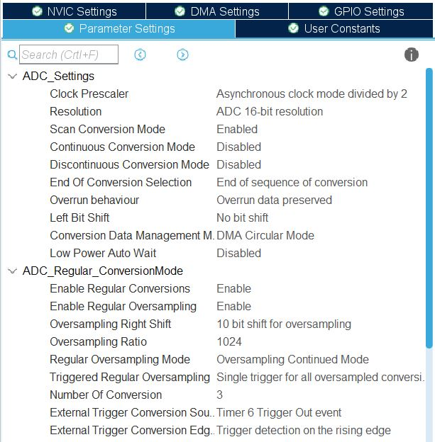
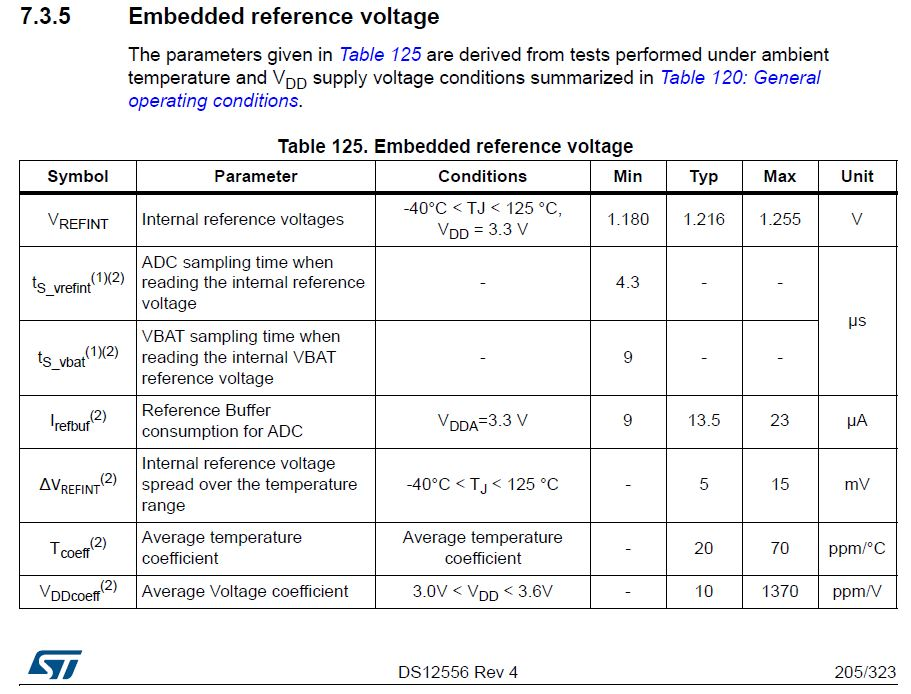
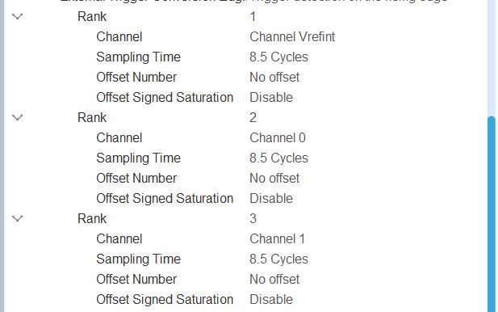
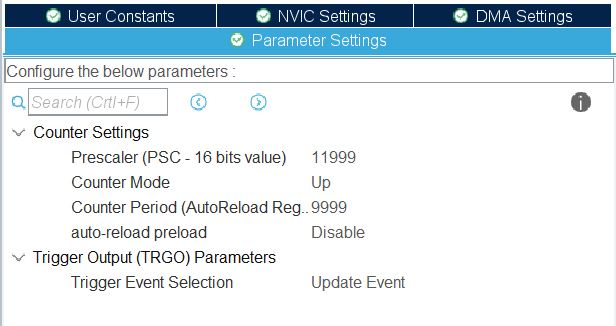
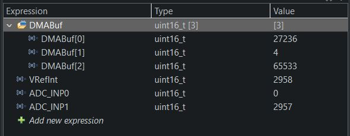
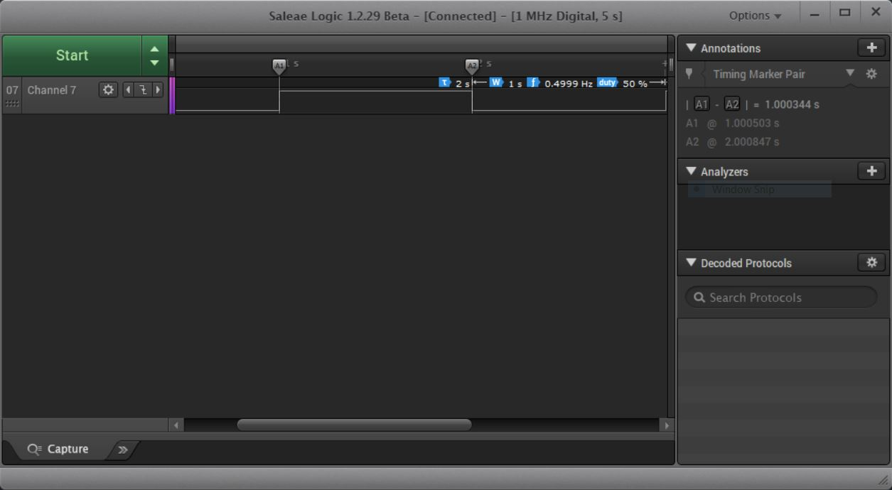

<h1>STM32H7 ADC Multi Channel Multi Conversion TriggerTimer with Oversample and data transmit with DMA</h1>

&nbsp;

Tested with STM32H750 in HAL & LL library, should be able ported to others. 
This example will convert several channels in burst mode from HW trigger: timer peripheral. 
Oversample ratio set to max 1024 and leftshift 10bits to average 1024 sample. 
DMA is configured to transfer conversion data in an array, in circular mode. 
Timer is configured in time base and to generate TRGO events.

Disable Discontinuous conversion for burst conversion 
Disable continuous conversion for single conversion 
End of conversion selection set to "End of sequence Conversion"

&nbsp;

To calculate minimum conversion time: 
ADCFreq = 37.5 / 2 = 18.75MHz 
Minimum Tconv = 1.5 + 0.5 + (16/2) = 10 cycle 
Sample Time = 10 cycle / 18.75 MHz = 0.533 us 
According the Datasheet, Vref need at least 4.3us, so minimum Vref sampling time must 8.5 cycles.

&nbsp;

The Rank Setting:

&nbsp;

Using basic timer TIM6 and set it to 10kHz(10000 cycle/second), 
10000 counter to trigger event at 1 second interval.

&nbsp;

ADC value is convert to voltage with build in macro, 
ADC_INP0 --> GND 
ADC_INP1 --> VCC 
The Output in Live Expression:

&nbsp;

Check the logic pin to see if the ADC is converted with 1sec interval.

&nbsp;

Comment/Suggestion are highly welcome!
